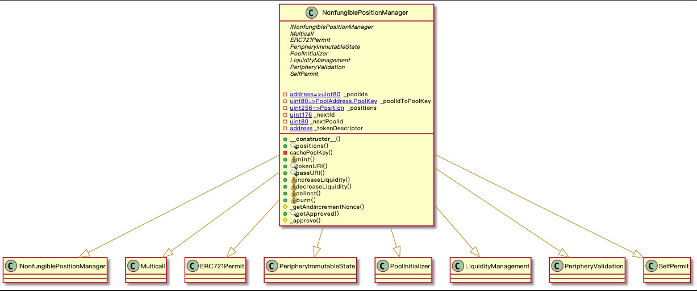

> uniswap v2版本代码分析仓库 [uniswap-v2-research](https://github.com/AarenWang/uniswap-v2-research)

### uniswap 版本功能变迁
V1版本
1. 只支持ETH到ERC20,简单,但是token A到token B两次兑换手续费和gas费

V2版本
1. 支持任意ERC20 Token对
2. 基于时间权重链上预言机 TWAP  时间均价代替实时价格
3. 闪电兑换 Flash Swap


V3版本
1. 聚焦流动性 更高效率的资金使用
2. virtual reserver
3. 新的价格计算机制


### 功能和用例
流动性管理
  - 流动池列表
  - 流动池查看
  - 创建池
  - 添加流动性
  - 删除流动性


兑换
 - 计算兑换价格
 - 执行兑换


### 合约
Uniswap v3 在代码层面的架构和 v2 基本保持一致，将合约分成了两个仓库
- uniswap-v3-core 
- uniswap-v3-periphery

core 仓库的功能主要包含在以下 2 个合约中：
- **UniswapV3Factory**: 提供创建 pool 的接口，并且追踪所有的 pool
- **UniswapV3Pool**: 实现代币交易，流动性管理，交易手续费的收取，oracle 数据管理。接口的实现粒度比较低，不适合普通用户使用，错误的调用其中的接口可能会造成经济上的损失。

peirphery 仓库的功能主要包含在以下 2 个合约：
- **SwapRouter**: 提供代币交易的接口，它是对 UniswapV3Pool 合约中交易相关接口的进一步封装，前端界面主要与这个合约来进行对接。
- **NonfungiblePositionManager**: 用来增加/移除/修改 Pool 的流动性，并且通过 NFT token 将流动性代币化。使用 ERC721 token（v2 使用的是 ERC20）的原因是同一个池的多个流动性并不能等价替换（v3 的集中流性动功能）

大致关系


**合约地址和代码文件**    

| Contract                           | Address                                      | Source Code                                                                                                                   | 
| ---------------------------------- | -------------------------------------------- | ----------------------------------------------------------------------------------------------------------------------------- |
| UniswapV3Factory                   | `0x1F98431c8aD98523631AE4a59f267346ea31F984` | https://github.com/Uniswap/uniswap-v3-core/blob/v1.0.0/contracts/UniswapV3Factory.sol                                         |
| Multicall2                         | `0x5BA1e12693Dc8F9c48aAD8770482f4739bEeD696` | https://etherscan.io/address/0x5BA1e12693Dc8F9c48aAD8770482f4739bEeD696#code                                                  |
| ProxyAdmin                         | `0xB753548F6E010e7e680BA186F9Ca1BdAB2E90cf2` | https://github.com/OpenZeppelin/openzeppelin-contracts/blob/v3.4.1-solc-0.7-2/contracts/proxy/ProxyAdmin.sol                  |
| TickLens                           | `0xbfd8137f7d1516D3ea5cA83523914859ec47F573` | https://github.com/Uniswap/uniswap-v3-periphery/blob/v1.0.0/contracts/lens/TickLens.sol                                       |
| Quoter                             | `0xb27308f9F90D607463bb33eA1BeBb41C27CE5AB6` | https://github.com/Uniswap/uniswap-v3-periphery/blob/v1.0.0/contracts/lens/Quoter.sol                                         |
| SwapRouter                         | `0xE592427A0AEce92De3Edee1F18E0157C05861564` | https://github.com/Uniswap/uniswap-v3-periphery/blob/v1.0.0/contracts/SwapRouter.sol                                          |
| NFTDescriptor                      | `0x42B24A95702b9986e82d421cC3568932790A48Ec` | https://github.com/Uniswap/uniswap-v3-periphery/blob/v1.0.0/contracts/libraries/NFTDescriptor.sol                             |
| NonfungibleTokenPositionDescriptor | `0x91ae842A5Ffd8d12023116943e72A606179294f3` | https://github.com/Uniswap/uniswap-v3-periphery/blob/v1.0.0/contracts/NonfungibleTokenPositionDescriptor.sol                  |
| TransparentUpgradeableProxy        | `0xEe6A57eC80ea46401049E92587E52f5Ec1c24785` | https://github.com/OpenZeppelin/openzeppelin-contracts/blob/v3.4.1-solc-0.7-2/contracts/proxy/TransparentUpgradeableProxy.sol |
| NonfungiblePositionManager         | `0xC36442b4a4522E871399CD717aBDD847Ab11FE88` | https://github.com/Uniswap/uniswap-v3-periphery/blob/v1.0.0/contracts/NonfungiblePositionManager.sol                          |
| V3Migrator                         | `0xA5644E29708357803b5A882D272c41cC0dF92B34` | https://github.com/Uniswap/uniswap-v3-periphery/blob/v1.0.0/contracts/V3Migrator.sol                                          |


**合约功能概述** 
#### TickLens
Tick 刻度  创建流动池子,选择价格区间,比如价格区间是90到110, 在这个价格区间里,实际swap时候不是任意数字都可以,而是一系列的离散数字,采用了等比数列的形式确定价格数列，公比为 1.0001。即下一个价格点为当前价格点的 100.01%，

 实际公式为:
 ```

 ```

####  合约功能描述 

| Contract                           | 描述                                                                                                                                                                          | 
| ---------------------------------- | ---------------------------------------------------------------------------------------------------------------------------------------------------------------------------- |
| UniswapV3Factory                   | 部署v3流动池子,管理所有者 控制池子费用                                                                                                                                             |
| Multicall2                         | 创建流动性池, 需要多次调用合约,通过先调用Multicall2合约,由Multicall2调用多个合约                                                                                                       |
| ProxyAdmin                         |                                                                                                                                                                              |
| TickLens                           | 管理价格区间刻度                                                                                                                                                                             |
| Quoter                             |                                                                                                                                                                              |
| SwapRouter                         | 执行兑换                                                                                                                                                                             |
| NFTDescriptor                      |                                                                                                                                                                              |
| NonfungibleTokenPositionDescriptor |                                                                                                                                                                              |
| TransparentUpgradeableProxy        |                                                                                                                                                                              |
| NonfungiblePositionManager         | 仓位管理,前端流动性操作与该合约交互                                                                                                                                                       |
| V3Migrator                         | 迁移V2版本流动性到V3版本                                                                                                                                                                             |


### 辅助合约代码阅读分析


### 核心功能代码阅读
#### 创建交易流动池
时序图


UML类图


过程 
1. 用户首先调用 NonfungiblePositionManager 合约的 createAndInitializePoolIfNecessary 方法创建交易对，传入的参数为交易对的 token0, token1, fee 和初始价格sqrt(P)
2. NonfungiblePositionManager 合约内部通过调用 UniswapV3Factory 的 createPool 方法完成交易对的创建，然后对交易对进行初始化，初始化的作用就是给交易对设置一个初始的价格。
3. createAndInitializePoolIfNecessary功能
4.  UniswapV3Factory 创建交易对的过程，实际上它是调用 deploy 函数完成交易对的创建：
5. 创建交易对，就是创建一个新的合约，作为流动池来提供交易功能。创建合约的步骤是：


PoolInitializer.createAndInitializePoolIfNecessary()
```
function createAndInitializePoolIfNecessary(
        address token0, 
        address token1,
        uint24 fee,
        uint160 sqrtPriceX96 //why X96
    ) external payable override returns (address pool) {
        require(token0 < token1);
        pool = IUniswapV3Factory(factory).getPool(token0, token1, fee);

        if (pool == address(0)) {
            pool = IUniswapV3Factory(factory).createPool(token0, token1, fee);
            IUniswapV3Pool(pool).initialize(sqrtPriceX96);
        } else {
            (uint160 sqrtPriceX96Existing, , , , , , ) = IUniswapV3Pool(pool).slot0();
            if (sqrtPriceX96Existing == 0) {
                IUniswapV3Pool(pool).initialize(sqrtPriceX96);
            }
        }
    }
```

UniswapV3Factory.createPool
```
function createPool(
        address tokenA,
        address tokenB,
        uint24 fee
    ) external override noDelegateCall returns (address pool) {
        require(tokenA != tokenB);
        (address token0, address token1) = tokenA < tokenB ? (tokenA, tokenB) : (tokenB, tokenA);
        require(token0 != address(0));
        int24 tickSpacing = feeAmountTickSpacing[fee];
        require(tickSpacing != 0);
        require(getPool[token0][token1][fee] == address(0));
        pool = deploy(address(this), token0, token1, fee, tickSpacing);
        getPool[token0][token1][fee] = pool;
        // populate mapping in the reverse direction, deliberate choice to avoid the cost of comparing addresses
        getPool[token1][token0][fee] = pool;
        emit PoolCreated(token0, token1, fee, tickSpacing, pool);
    }
```


UniswapV3Factory.deploy()函数
```
function deploy(
    address factory,
    address token0,
    address token1,
    uint24 fee,
    int24 tickSpacing
) internal returns (address pool) {
    parameters = Parameters({factory: factory, token0: token0, token1: token1, fee: fee, tickSpacing: tickSpacing});
    pool = address(new UniswapV3Pool{salt: keccak256(abi.encode(token0, token1, fee))}());
    delete parameters;
}
```

Parameters结构体,将deploy函数参数封装成struct
```
struct Parameters {
        address factory;
        address token0;
        address token1;
        uint24 fee;
        int24 tickSpacing;
    }
```


调用UniswapV3Pool.sol构造方法
```
  constructor() {
        int24 _tickSpacing;
        (factory, token0, token1, fee, _tickSpacing) = IUniswapV3PoolDeployer(msg.sender).parameters();
        tickSpacing = _tickSpacing;

        maxLiquidityPerTick = Tick.tickSpacingToMaxLiquidityPerTick(_tickSpacing);
    }


```


#### 添加流动性

##### Tick
UniswapV3将连续的价格范围，分割成有限个离散的价格点。每一个价格对应一个 tick，用户在设置流动性的价格区间时，只能选择这些离散的价格点中的某一个作为流动性的边界价格。
- tick组成的价格序列既为一串等比数列，公比为 1.0001 ，下一个价格点为当前价格点的 100.01%。
- 为了计算方便，实际上储存的是√P。而使用时，通常使用tick的序号 i。
- tick的序号是固定的整数集合，即 区间 [-887272, 887272] 的整数。原因见下方 TickMath


**Tick and range**
在完整的介绍流动性之前,需要先介绍v3引入的价格刻度(Tick),用户添加流动性时候选择价格区间,在该区间范围内进行交易兑换(AMM),兑换价格被拆分为一系列离散的点
刻度的点距离不是算术平均,而是成指数变化
```
p(i) = pow(1.0001,i)
1.00001的100次方为1.0100496621
```

**Global State**

**Tick-Index State**


在合约内，v3 会保存所有用户的流动性，代码内称作 Position，提供流动性的调用流程如下


**时序图**
```sequence
    User Interface ->>MultiCall: multicall()
    MultiCall.multicall ->>NonfungiblePositionManager: mint()
    NonfungiblePositionManager-->>UniswapV3Pool: contract!
    NonfungiblePositionManager-->>LiquidityManagement: addLiquidity:
    NonfungiblePositionManager-->MultiCall: Position 
```

**添加流动性结构体参数**
```
struct AddLiquidityParams {
    address token0;     // token0 的地址
    address token1;     // token1 的地址
    uint24 fee;         // 交易费率
    address recipient;  // 流动性的所属人地址
    int24 tickLower;    // 流动性的价格下限（以 token0 计价），这里传入的是 tick index
    int24 tickUpper;    // 流动性的价格上线（以 token0 计价），这里传入的是 tick index
    uint128 amount;     // 流动性 L 的值
    uint256 amount0Max; // 提供的 token0 上限数
    uint256 amount1Max; // 提供的 token1 上限数
}
```


LiquidityManagerment.sol (被NonfungiblePositionManager继承)
```
function addLiquidity(AddLiquidityParams memory params)
    internal
    returns (
        uint256 amount0,
        uint256 amount1,
        IUniswapV3Pool pool
    )
{
    PoolAddress.PoolKey memory poolKey =
        PoolAddress.PoolKey({token0: params.token0, token1: params.token1, fee: params.fee});

    // 这里不需要访问 factory 合约，可以通过 token0, token1, fee 三个参数计算出 pool 的合约地址
    pool = IUniswapV3Pool(PoolAddress.computeAddress(factory, poolKey));

    (amount0, amount1) = pool.mint(
        params.recipient,
        params.tickLower,
        params.tickUpper,
        params.amount,
        // 这里是 pool 合约回调所使用的参数
        abi.encode(MintCallbackData({poolKey: poolKey, payer: msg.sender}))
    );

    require(amount0 <= params.amount0Max);
    require(amount1 <= params.amount1Max);
}
```

- 传入的 lower/upper 价格是以 tick index 来表示的，因此需要在链下先计算好价格所对应的 tick index
- 传入的是流动性 L 的大小，这个也需要在链下先计算好，计算过程见下面
- 我们不需要访问 factory 就可以计算出 pool 的地址，实现原理见 CREATE2
- 这里有一个回调函数的参数。v3 使用回调函数来完成进行流动性 token 的支付操作，原因见下面

#### 迁移v2

#### 预言机

#### 闪电贷


### 技术问题

#### 数学运算和技巧


#### multicall
通常一次合约调用只能调用一个方法,如何突破这个限制? 部署一个```multicall```合约,外部账户EOA先调用```multicall```,```multicall```然后调用多个不同合约
```multicall```合约方法如下
```
 function multicall(bytes[] calldata data) public payable override returns (bytes[] memory results) {
        results = new bytes[](data.length);
        for (uint256 i = 0; i < data.length; i++) {
            (bool success, bytes memory result) = address(this).delegatecall(data[i]);

            if (!success) {
                // Next 5 lines from https://ethereum.stackexchange.com/a/83577
                if (result.length < 68) revert();
                assembly {
                    result := add(result, 0x04)
                }
                revert(abi.decode(result, (string)));
            }

            results[i] = result;
        }
    }
```


#### abi encode  decode


### 彩蛋


#### 仓位 NFT
[Uniswap V3 Positions](https://opensea.io/collection/uniswap-v3-positions)


### 附录
#### 参考文档
uniswap v3部署体验 [链接](https://daoleno.com/uniswapv3-deployment-guide/)


####  代码量统计

```
➜  uniswap-v3-research git:(master) ✗ cloc v3-sdk
      73 text files.
      68 unique files.
       5 files ignored.

github.com/AlDanial/cloc v 1.92  T=0.06 s (1164.3 files/s, 140414.0 lines/s)
-------------------------------------------------------------------------------
Language                     files          blank        comment           code
-------------------------------------------------------------------------------
TypeScript                      63            844            787           6425
JSON                             2              0              0             72
YAML                             2             13              0             45
Markdown                         1              4              0             11
-------------------------------------------------------------------------------
SUM:                            68            861            787           6553
-------------------------------------------------------------------------------
```


```
➜  uniswap-v3-research git:(master) ✗ cloc v3-core
     129 text files.
     106 unique files.
      23 files ignored.

github.com/AlDanial/cloc v 1.92  T=0.08 s (1376.2 files/s, 177066.1 lines/s)
-------------------------------------------------------------------------------
Language                     files          blank        comment           code
-------------------------------------------------------------------------------
TypeScript                      23            691             93           5925
Solidity                        69            807           1187           4247
Markdown                         3            101              0            207
YAML                             8             37             74            191
JSON                             3              0              0             78
-------------------------------------------------------------------------------
SUM:                           106           1636           1354          10648
-------------------------------------------------------------------------------
```


```
➜  uniswap-v3-research git:(master) ✗ cloc v3-periphery
     153 text files.
     129 unique files.
      24 files ignored.

github.com/AlDanial/cloc v 1.92  T=0.08 s (1527.5 files/s, 170982.5 lines/s)
-------------------------------------------------------------------------------
Language                     files          blank        comment           code
-------------------------------------------------------------------------------
TypeScript                      41           1141            137           7186
Solidity                        76            605            836           4053
JSON                             4              0              0            244
Markdown                         5             48              0            117
YAML                             2             14              1             57
SVG                              1              0              0              1
-------------------------------------------------------------------------------
SUM:                           129           1808            974          11658
-------------------------------------------------------------------------------
```
